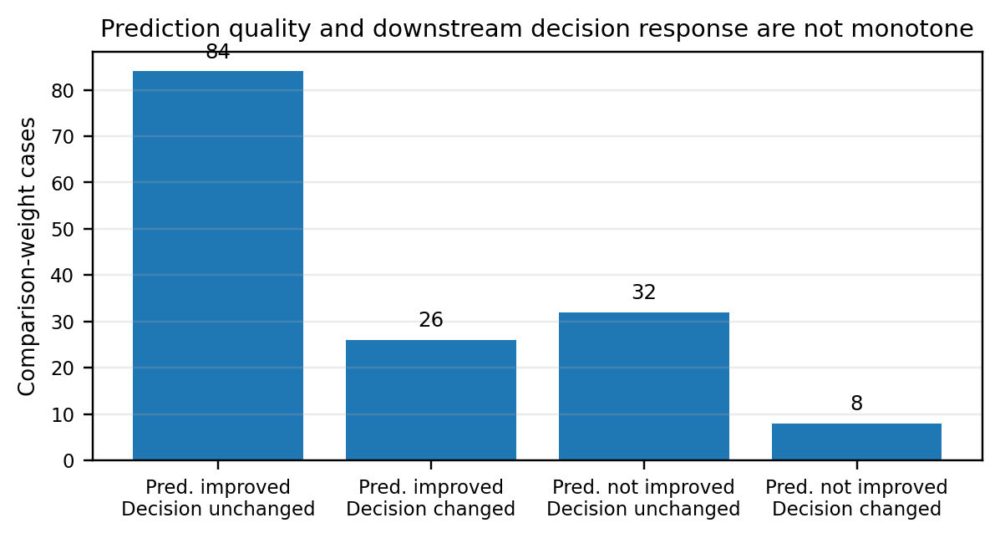
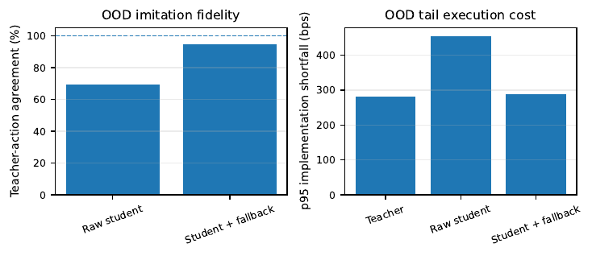
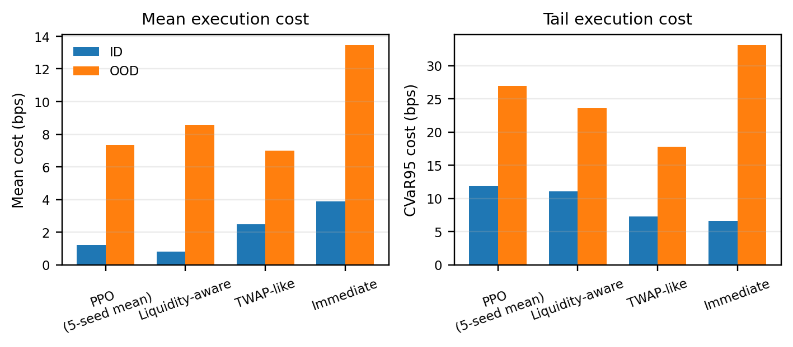
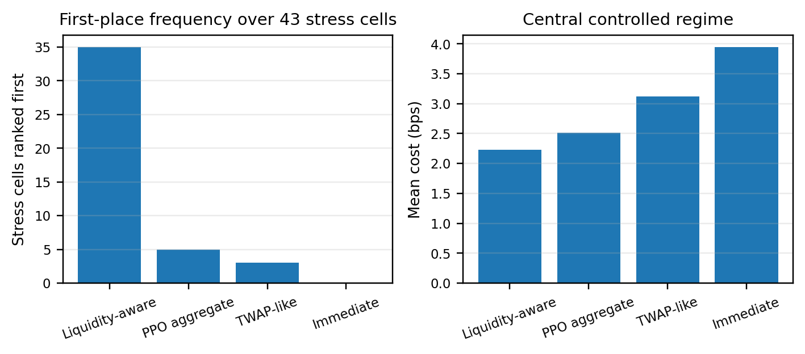
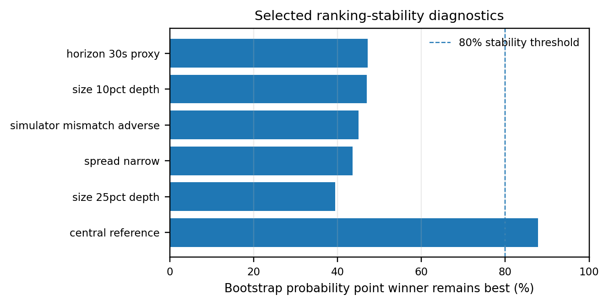
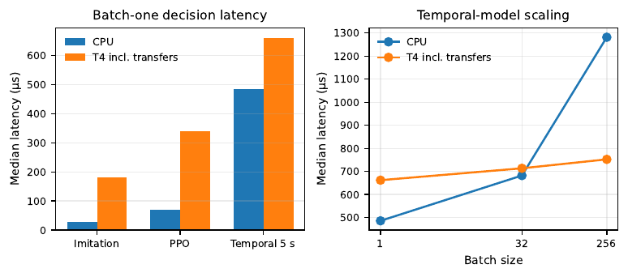

# Robust ML-Assisted Optimal Execution in Limit Order Books

[](https://github.com/000zer000/robust-ml-optimal-execution/actions/workflows/ci.yml)
[](https://github.com/000zer000/robust-ml-optimal-execution/actions/workflows/reproducibility.yml)
[](https://github.com/000zer000/robust-ml-optimal-execution/actions/workflows/sanitizers.yml)
[](paper/Robust_ML_Optimal_Execution_Research_Paper.pdf)


A reproducible C++/Python research system for **optimal execution in limit-order-book markets**, combining exact market mechanics, causal microstructure forecasting, model predictive control, imitation learning, reinforcement learning, dependence-aware robustness analysis, and low-latency CPU/GPU performance engineering.

## Research paper

**Robust ML-Assisted Optimal Execution in Limit Order Books: Causal Microstructure Forecasting, Model Predictive Control, and Low-Latency Systems Evaluation**

**[Read the full 16-page IEEE-style paper](paper/Robust_ML_Optimal_Execution_Research_Paper.pdf)** · [LaTeX](paper/main.tex) · [BibTeX](paper/references.bib)

The paper formulates execution as a sequential decision problem in which forecast quality, queue uncertainty, transaction costs, market impact, latency, inventory risk, and compute overhead interact. The central question is whether better short-horizon microstructure forecasts improve the **downstream execution decision**, rather than merely improving a standalone prediction metric.

## Contributions

- **Exact C++20 market core:** deterministic event ordering, integer ticks/lots, price-time-priority matching, replay, execution accounting, latency, and invariant/sanitizer validation.
- **Queue-aware optimal execution:** immediate, TWAP-like, volume-informed, Almgren-Chriss-style, liquidity-aware, and receding-horizon MPC baselines under common accounting and terminal-completion rules.
- **Causal ML pipeline:** a frozen 20-feature microstructure contract, logistic/GBDT/MLP baselines, probability calibration, and a compact Conv1D-LSTM temporal model at 250 ms, 1 s, and 5 s horizons.
- **Matched ML-assisted MPC:** the same optimizer, action space, queue model, latency model, and terminal logic as non-ML MPC, with only a prediction-derived risk term added.
- **Decision-value ablations:** base-rate, shuffled, stale, uncalibrated, oracle, and zero-weight controls explicitly separate forecast quality from control value.
- **Imitation learning:** exact C++ teacher oracle, behavior cloning, validation-triggered DAgger correction, OOD diagnostics, and conservative fallback.
- **Reinforcement learning:** categorical PPO with six execution actions, multi-seed evaluation, independently reconstructable rewards, and reward-hacking tests.
- **Robustness and statistics:** 43 registered stress conditions, paired evaluation, moving-block bootstrap, Holm correction, and bootstrap ranking stability.
- **High-performance systems evaluation:** profile-driven C++ optimization, multithread scaling, compiled inference, direct Python/C++ boundary measurement, and transfer-inclusive Tesla T4 CUDA benchmarks.

## System architecture

```text
Market events ──> C++ matching / LOB state ──> replay + queue models
                                               │
                                               v
                                      causal features / targets
                                               │
                           ┌───────────────────┴───────────────────┐
                           v                                       v
                    predictors                         classical / MPC control
                simple + Conv1D-LSTM                         │
                           │                                  v
                           └──────────────> matched ML-MPC ───┤
                                                              │
                                      imitation / DAgger <────┤
                                      categorical PPO <───────┤
                                                              v
                                      common execution accounting
                                shortfall · CVaR · completion · actions
                                                              │
                                          robustness + block bootstrap
                                                              │
                                      CPU · C++ · pybind · CUDA profiling
```

## Selected results

### Prediction quality is not decision quality

On the engineering holdout, calibration and controller response are non-monotonic. At the 5 s horizon, calibration improves log loss relative to the uncalibrated temporal model, yet the uncalibrated prediction changes the MPC at a lower prediction-risk weight. The perfect intermediate-event oracle can also produce worse implementation shortfall, revealing target-objective misalignment.



### Imitation learning exposes covariate shift

A compact one-hidden-layer policy reaches **100% action agreement on the controlled holdout**, but raw OOD agreement falls to **69.30%**. A validation-selected fallback raises OOD agreement to **94.78%**, while making the fallback rate itself an explicit latency/robustness trade-off.



### PPO does not dominate strong execution baselines

Across five registered PPO seeds, the liquidity-aware heuristic has the lower in-distribution mean cost, while the TWAP-like baseline is stronger on OOD mean/tail cost in the registered experiment.



### Strategy rankings change under stress

The robustness suite evaluates **43 registered stress conditions** across latency, liquidity, spread, volatility, queue assumptions, fees, parent size, horizon, impact misspecification, degraded predictions, data loss, distribution shift, compute budgets, and simulator mismatch. The identity of the lowest-cost strategy changes in **16 of 42 non-central regimes**.



### Uncertainty materially changes the interpretation of winners

The statistical analysis uses a paired moving-block bootstrap with **4,096 replications per contrast**. Of **129 paired contrasts, 85** have 95% intervals crossing zero; only **21 of 43** point-estimate stress winners have at least 80% bootstrap probability of remaining best.



### CPU/GPU conclusions are workload-specific

A profile-guided matching-engine capacity optimization reaches approximately **17.3 million operations/s** in the measured four-thread workload. On a Tesla T4, transfer-inclusive GPU inference is slower than CPU for every registered **batch-one** workload; the temporal model becomes GPU-favorable at batch 256 at approximately **1.70x** transfer-inclusive speedup.



## Technology stack

| Area | Technologies |
|---|---|
| Market / execution core | C++20, CMake, integer tick/lot arithmetic, deterministic event simulation |
| Optimization | finite-horizon MPC, Almgren-Chriss-style scheduling, queue-aware control |
| Machine learning | scikit-learn, PyTorch, calibration, Conv1D, LSTM, MLP |
| Sequential learning | behavior cloning, DAgger, categorical PPO |
| Statistics | paired moving-block bootstrap, CVaR, Holm multiplicity correction |
| Performance | GCC, Clang, ASan/UBSan, profiling, multithreading, pybind, TorchScript/compile experiments, CUDA/Tesla T4 |
| Reproducibility | pytest, schemas, SHA-256 artifacts, Docker, GitHub Actions, frozen experiment configurations |

## Experimental design

The repository separates training, validation, calibration, controlled holdout, and OOD populations. Causal feature cutoffs precede decision times; model selection and calibration use separate partitions; RL reports every registered development seed; controller ablations share the same mechanical execution path; and robustness comparisons reuse paired episode seeds.

Strategy results in the manuscript are controlled simulator experiments. Systems results are direct measurements on the documented CPU and Tesla T4 environments. Historical-feed admission, sequence-continuity checks, and replay contracts are implemented under `docs/data/` and the corresponding validation scripts.

## Reproduce

### Native C++ core

```bash
# Linux
cmake --preset gcc-debug
cmake --build --preset gcc-debug
ctest --preset gcc-debug

# macOS (use this preset instead)
cmake --preset clang-debug
cmake --build --preset clang-debug
ctest --preset clang-debug
```

### Python research stack

```bash
python -m venv .venv
. .venv/bin/activate
python -m pip install -r requirements/test.lock
PYTHONPATH=python python -m pytest --cov=robust_execution --cov-branch tests/python
```

### Release checks

```bash
python scripts/verify_specification_lock.py
python scripts/validate_repository.py
python scripts/validate_release.py
```

### Docker

```bash
docker build -t robust-execution .
docker run --rm robust-execution --help
```

The full reproduction sequence is documented in [`docs/release/REPRODUCIBILITY.md`](docs/release/REPRODUCIBILITY.md).

## Repository map

```text
cpp/                 C++ matching engine, simulator, strategies, benchmarks, tests
python/              Causal ML, temporal models, imitation learning, RL, statistics
paper/               Research paper PDF, LaTeX source, bibliography, publication figures
configs/             Frozen and engineering experiment configurations
schemas/             Versioned JSON interchange contracts
data/sample/         Deterministic research fixtures
evidence/            Hardware/data evidence used by the release
scripts/             Generators, validators, profiling and reproduction tools
tests/               Python validation and regression suites
docs/                Architecture, market-data, controller and methodology documentation
results/validation/  Deterministic validation artifacts
STEP*_*.md/json      Immutable staged validation ledger and artifact hashes
```

## Verification

The release is exercised under GCC and Clang builds plus ASan/UBSan and ThreadSanitizer, with **53/53 native tests** in each matrix. The Python suite contains **478 tests** and enforces at least **90% branch-aware repository coverage**. Research artifacts use byte regeneration on the canonical Linux x86-64/Python 3.13 environment. Other platforms require two byte-identical same-host regenerations plus the registered numeric or scientific-contract checks; model-training bytes are not claimed portable across ML/BLAS kernels.

## Citation

If you use the software or methodology, cite the repository using [`CITATION.cff`](CITATION.cff) and the accompanying paper in [`paper/`](paper/).

## License

MIT License. See [`LICENSE`](LICENSE).

**Author:** Othmane Hassani · ESILV Graduate School of Engineering, De Vinci Higher Education, Paris-La Défense, France
