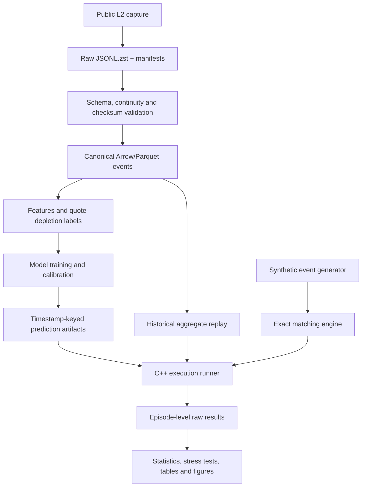

# Robust Execution

**Learning Robust Execution Policies in Limit Order Books: Prediction, Optimisation and Stress Testing under Latency and Regime Shifts**

> **Status:** Phase 0 — specification and repository bootstrap. No empirical result is claimed yet.

Robust Execution is a reproducible C++/Python research platform for testing whether machine-learning-assisted execution decisions improve over strong classical baselines, and whether any improvement survives latency, liquidity shifts, queue-model error, fee changes, and out-of-distribution market regimes.

The project studies how to execute a predetermined parent order. It is not a price-prediction trading bot, a live-trading system, or evidence of real-market profitability.

---

## Research question

> Does a calibrated short-horizon quote-depletion model, integrated into a queue-aware receding-horizon controller, reduce implementation shortfall relative to the same controller without machine learning and to strong classical baselines on locked out-of-sample episodes?

Secondary questions examine robustness, calibration versus decision value, and the latency/throughput cost of the prediction layer.

---

## Why this project is structured in two modes

Public level-2 data provides aggregate quantity at price levels, not complete individual-order identities. The repository therefore separates:

1. **Synthetic exact mode** — an event-driven C++ matching engine with price-time priority, individual orders, cancellations, partial fills, and known queue position.
2. **Historical aggregate mode** — deterministic replay of public level-2 updates with explicit optimistic, neutral, and pessimistic queue assumptions.

This avoids claiming exact historical queue reconstruction when the data does not support it.

---

## v1.0 scope

### Data

- Primary venue: Coinbase Exchange public level-2 feed.
- Instruments: BTC-USD and ETH-USD.
- Raw messages, checksums, connection metadata, and sequence diagnostics retained.
- Canonical Arrow/Parquet event store.
- Six-week usable dataset target after a successful 72-hour pilot.

### Strategies

- immediate aggressive execution;
- TWAP;
- past-only volume-profile schedule;
- Almgren–Chriss schedule;
- non-ML queue-aware adaptive controller;
- ML-assisted queue-aware receding-horizon controller.

### Prediction layer

Primary target:

> probability that the relevant best quote depletes or is traded through within a short fixed horizon.

Required models:

- logistic regression;
- histogram gradient boosting;
- probability calibration when supported by validation diagnostics.

A temporal neural model is optional and gated. Reinforcement learning is outside v1.0.

### Evaluation

- chronological train/validation/locked-test split;
- paired strategy evaluation on identical episodes;
- implementation shortfall including terminal completion as the primary metric;
- tail cost, completion, adverse selection, passive/aggressive mix, cancellations, latency, throughput, and memory as secondary metrics;
- paired block bootstrap, effect sizes, ablations, sensitivity analysis, and stress tests;
- explicit negative findings and limitations.

---

## Architecture



### Core boundaries

```text
cpp/
  core types and fixed-point values
  synthetic matching engine
  aggregate book state
  deterministic event scheduler
  latency and queue models
  execution policies
  fills, account and metrics
  pybind11 bindings

python/
  capture orchestration
  data validation and conversion
  features and labels
  model training and calibration
  optimisation research
  experiment manifests
  statistical evaluation
  plotting and report generation
```

Core experiments consume precomputed predictions. This keeps replay deterministic and separates model quality from language-binding overhead. Inference latency is measured and injected explicitly; compiled inference is a later extension.

---

## Planned repository structure

```text
robust-execution/
├── README.md
├── LICENSE
├── CITATION.cff
├── CHANGELOG.md
├── PROJECT_CONTEXT.md
├── RESEARCH_PROTOCOL.md
├── ROADMAP.md
├── DECISIONS.md
├── CONTRIBUTING.md
├── pyproject.toml
├── CMakeLists.txt
├── CMakePresets.json
├── Makefile
├── Dockerfile
├── .github/workflows/
├── configs/
│   ├── data/
│   ├── models/
│   ├── strategies/
│   ├── stress_tests/
│   └── experiments/
├── cpp/
│   ├── include/robust_execution/
│   ├── src/
│   ├── bindings/
│   ├── benchmarks/
│   └── tests/
├── python/
│   └── robust_execution/
│       ├── capture/
│       ├── data/
│       ├── features/
│       ├── labels/
│       ├── models/
│       ├── optimisation/
│       ├── evaluation/
│       ├── plotting/
│       └── utils/
├── scripts/
├── tests/
├── experiments/
│   ├── manifests/
│   ├── runs/
│   └── summaries/
├── results/
│   ├── raw/
│   ├── processed/
│   ├── tables/
│   └── figures/
├── data/
│   ├── raw/
│   ├── interim/
│   ├── processed/
│   └── sample/
├── paper/
│   ├── main.tex
│   ├── sections/
│   ├── figures/
│   ├── tables/
│   └── references.bib
└── docs/
```

The structure may be simplified after the repository audit. Empty directory theatre is not a goal.

---

## Planned developer commands

These commands define the intended interface; they are not yet implemented at Phase 0.

```bash
# Configure and build C++
cmake --preset dev
cmake --build --preset dev

# Run C++ and Python tests
ctest --preset dev --output-on-failure
python -m pytest

# Static checks
python -m ruff check .
python -m mypy python/robust_execution

# Fast deterministic reproduction
make reproduce-fast

# Data capture pilot
python -m robust_execution.capture.coinbase \
  --products BTC-USD ETH-USD \
  --channels level2 matches heartbeat \
  --config configs/data/coinbase_pilot.yaml

# Development experiment
python -m robust_execution.experiments.run \
  --config configs/experiments/dev_baselines.yaml

# Regenerate tables and figures
make report-assets
```

The final quick start will use lightweight sample data and will not require downloading the full research dataset.

---

## Scientific controls

The project follows these non-negotiable controls:

- no random event-level train/test mixing;
- no final-test hyperparameter tuning;
- no future data in features, labels, volume profiles, or parent sizing;
- no weaker baseline settings to favour ML;
- no reporting only the best seed, day, or instrument;
- no hidden queue assumptions;
- no unexecuted inventory omitted from cost;
- no manual transfer of final numbers into figures or the report;
- no claim that crypto results generalise automatically;
- no claim of live profitability.

See [`RESEARCH_PROTOCOL.md`](RESEARCH_PROTOCOL.md) for complete definitions.

---

## Core metrics

The primary metric is signed implementation shortfall in basis points relative to the arrival mid-price, including a common terminal-completion rule.

Secondary metrics include:

- CVaR and upper-tail execution cost;
- completion and residual inventory;
- forced-liquidation cost;
- passive and aggressive fractions;
- time to fill;
- adverse selection after fills;
- cancellations;
- decision and model latency;
- replay throughput and memory.

Every metric will be generated from saved episode-level outputs.

---

## Main anticipated limitations

- aggregate public level-2 data does not reveal exact order identity or queue position;
- passive fills in historical replay depend on explicit queue assumptions;
- ghost execution assumes the strategy does not causally alter the future market path;
- endogenous market impact is simplified in historical mode;
- initial evidence comes from crypto markets and two instruments;
- synthetic regimes are controlled experiments, not automatically realistic market replicas;
- a good simulated result is not evidence of deployable profitability.

These limitations are research variables to test, not text to hide.

---

## Roadmap

1. audit existing repositories and bootstrap CI;
2. implement and validate exact synthetic matching;
3. run the market-data pilot and build aggregate replay;
4. implement queue and latency models;
5. implement strong classical baselines;
6. build leakage-safe labels and supervised models;
7. integrate ML predictions and freeze the final protocol;
8. run locked evaluation and robustness tests;
9. profile and optimise measured bottlenecks;
10. publish Technical Report — Version 1.0 and a reproducible release.

See [`ROADMAP.md`](ROADMAP.md) for acceptance criteria.

---

## Reuse strategy

The project will reuse proven patterns from two existing projects:

- derivatives engine: CMake, pybind11, CTest, sanitizers, repeated-seed validation, fixed-hardware benchmarks, and C++/Python cross-checks;
- power-market platform: provenance, timestamp checks, chronological splits, isolated testing, optimisation validation, bootstrap intervals, sensitivity analysis, and automatic result generation.

Domain-specific pricing, battery, and hourly-market logic will not be copied into the new architecture.

---

## Initial references

- Robert Almgren and Neil Chriss, *Optimal Execution of Portfolio Transactions*.
- Rama Cont, Arseniy Kukanov, and Sasha Stoikov, *The Price Impact of Order Book Events*.
- Zihao Zhang, Stefan Zohren, and Stephen Roberts, *DeepLOB: Deep Convolutional Neural Networks for Limit Order Books*.
- Coinbase Exchange WebSocket and level-2 market-data documentation.
- Binance public-data and Spot WebSocket documentation.
- ABIDES official repository and associated paper, reserved as a possible later independent simulation comparison.

A checked BibTeX bibliography will be added during the related-work phase. No citation will be fabricated.

---

## Current state

Completed:

- scope audit;
- precise v1.0 definition;
- initial research protocol;
- architecture and technology direction;
- milestone plan and decision log.

Not completed:

- repository code audit;
- executable scaffold;
- data pilot;
- simulator implementation;
- experiments or results.

**Next action:** provide the complete derivatives-pricing and power-market repositories for a file-level reuse audit and scaffold creation.
